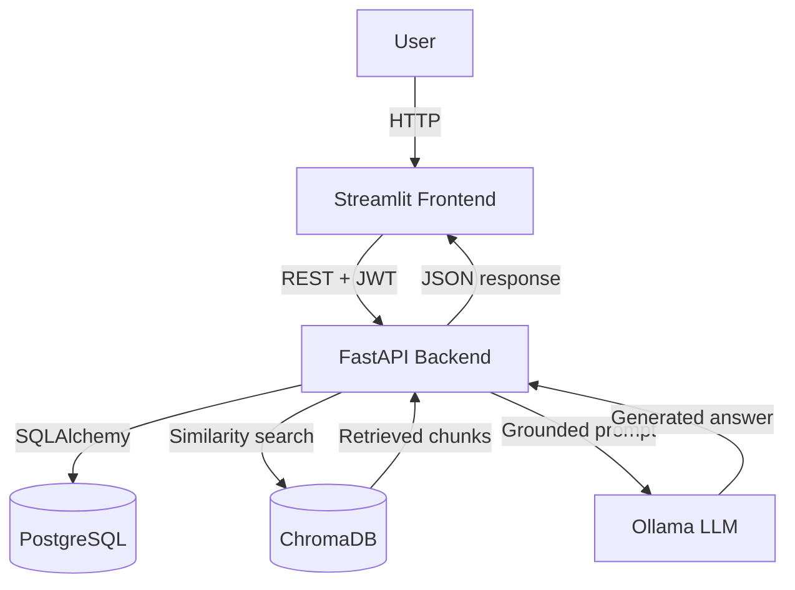
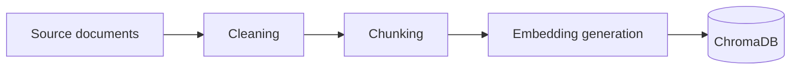
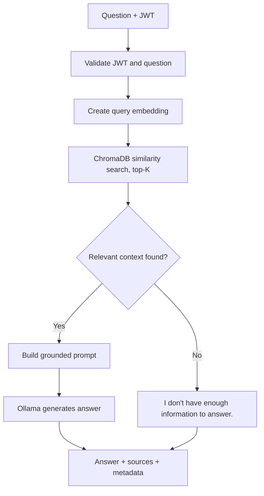
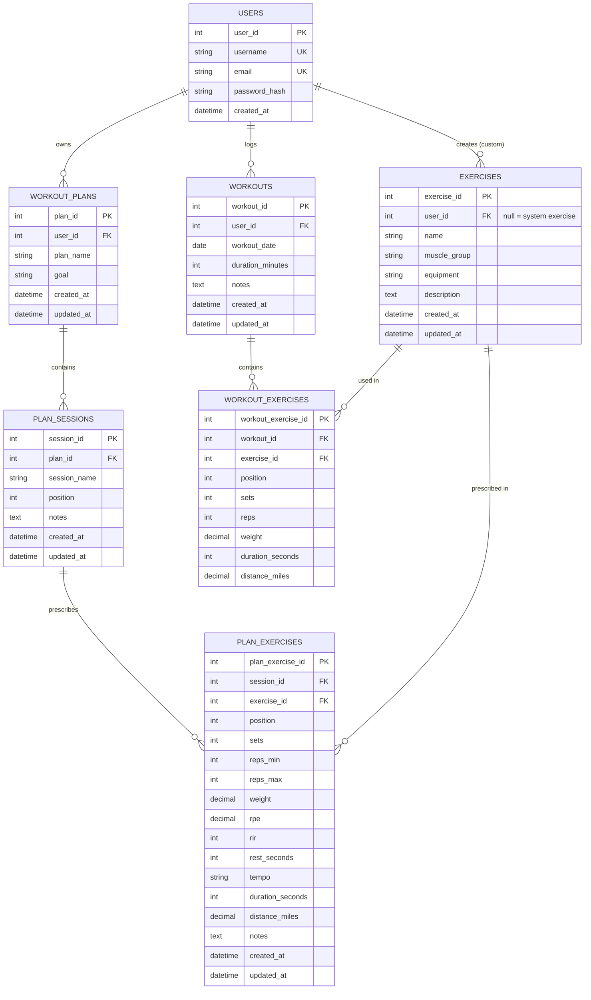

# AI Fitness Tracker

An AI-powered fitness application that lets users log workouts and ask a RAG-powered assistant training questions answered from trusted fitness documents.

## Table of Contents

1. [Features](#features)
2. [Tech Stack](#tech-stack)
3. [Architecture](#architecture)
4. [Quick Start](#quick-start)
5. [Configuration](#configuration)
6. [Using the Application](#using-the-application)
7. [API Reference](#api-reference)
8. [RAG Pipeline](#rag-pipeline)
9. [Database Schema](#database-schema)
10. [Authentication & Authorization](#authentication--authorization)
11. [Error Handling](#error-handling)
12. [Testing](#testing)
13. [Project Structure](#project-structure)
14. [Design Decisions & Risks](#design-decisions--risks)

---

## Features

- Register, log in, and manage your own workouts and training plans
- Browse a shared system exercise library and create private custom exercises
- Log every exercise in a workout with required sets and reps, plus optional weight, time, and distance (for example a run or a bike ride)
- Build structured training plans: sessions (for example Push, Pull, Legs) containing exercise prescriptions with sets, rep ranges, load, effort (RPE/RIR), rest, tempo, and notes
- Keep planned training (plans) separate from completed training (workouts)
- Ask a fitness assistant questions and get answers grounded in curated documents, with source citations
- Clear "not enough information" responses instead of unsupported answers
- Fully containerized: one command starts every service

## Tech Stack

| Layer | Technology |
| --- | --- |
| Backend API | FastAPI |
| ORM / Database | SQLAlchemy + PostgreSQL |
| Validation | Pydantic |
| Authentication | JWT |
| Vector store | ChromaDB |
| LLM | Ollama (local model) |
| Frontend | Streamlit |
| Containers | Docker & Docker Compose |
| Testing | Pytest |
| Language | Python |

## Architecture

The application uses a containerized, service-oriented architecture. FastAPI is the single entry point for the frontend and orchestrates the database, vector store, and LLM.



| Service | Responsibility |
| --- | --- |
| **Streamlit** | User interface: login/register, dashboard, exercise library, workouts, AI assistant |
| **FastAPI** | API, authentication/authorization, validation, business logic, RAG orchestration, health checks |
| **PostgreSQL** | Persistent structured data (users, workouts, exercises, plans) |
| **ChromaDB** | Vector embeddings and fitness knowledge retrieval |
| **Ollama** | Local LLM inference |

Services communicate over the Docker Compose network using service names (for example `http://ollama:11434`), not `localhost`.

### Persistent Storage

Docker volumes keep data across container restarts: `postgres_data`, `chroma_data`, `ollama_data` (downloaded LLM), and `model_cache` (the embedding model used by ChromaDB).

## Quick Start

### Prerequisites

- Docker and Docker Compose
- Enough free RAM for a local LLM (use a smaller model if resources are limited)

### Setup

```bash
# 1. Clone the repository and open the project folder
git clone <your-repo-url>
cd <repo-folder>/ai-fitness-tracker

# 2. Create your environment file and set a real JWT secret
cp .env.example .env
python -c "import secrets; print(secrets.token_urlsafe(48))"   # paste the output as JWT_SECRET_KEY in .env

# 3. Start all services
docker compose up --build -d

# 4. Pull the LLM into the Ollama container (first run only)
docker compose exec ollama ollama pull llama3.2:3b

# 5. Load the system exercise library (first run only; safe to re-run)
docker compose exec backend python seed_exercises.py

# 6. Load the fitness documents into ChromaDB (first run only; safe to re-run)
docker compose exec backend python ingest_docs.py

# 7. Restart the backend so it picks up the newly loaded documents
docker compose restart backend
```

The first ingest also downloads a small embedding model, so it needs internet access. When every service shows `healthy` in `docker compose ps`, open the Streamlit app.

### Access

| Component | URL |
| --- | --- |
| Streamlit app | http://localhost:8501 |
| FastAPI docs (Swagger) | http://localhost:8000/docs |
| Health check | http://localhost:8000/health |

The sidebar in the Streamlit app shows the live health of the database, ChromaDB, and Ollama. It reads *degraded* until the model is pulled and the documents are ingested.

## Configuration

All configuration is provided through environment variables. Secrets are never committed; `.env.example` documents the required values without real credentials.

| Variable | Purpose |
| --- | --- |
| `POSTGRES_USER`, `POSTGRES_PASSWORD`, `POSTGRES_DB` | Credentials for the PostgreSQL container (keep in sync with `DATABASE_URL`) |
| `DATABASE_URL` | PostgreSQL connection string |
| `JWT_SECRET_KEY` | Secret used to sign JWTs (at least 32 characters; the app refuses to start otherwise) |
| `ACCESS_TOKEN_EXPIRE_MINUTES` | JWT lifetime in minutes (default `60`) |
| `CORS_ORIGINS` | Comma-separated list of allowed frontend origins (default `http://localhost:8501`) |
| `OLLAMA_URL` | Ollama service URL |
| `MODEL_NAME` | Ollama model used for answers (configurable without code changes) |
| `OLLAMA_TIMEOUT_SECONDS` | Seconds to wait for Ollama before `/ask` answers `503` (default `120`) |
| `CHROMA_PATH` | ChromaDB storage directory (Docker Compose mounts a volume at `/data/chroma`) |
| `COLLECTION_NAME` | ChromaDB collection name (default `fitness_docs`) |
| `DOCS_DIRECTORY` | Folder of `.txt` source documents for ingestion (Docker Compose mounts `./docs` at `/docs`) |
| `CONFIDENCE_THRESHOLD` | Minimum cosine similarity (0-1) for a chunk to count as relevant (default `0.30`) |
| `TOP_K` | Number of chunks retrieved per question (default `4`) |

## Using the Application

1. **Register and log in** from the authentication page.
2. **Check the dashboard** for your workout, plan, and exercise counts and your most recent workouts. The sidebar shows who is signed in, a log-out button, and the health of the backend services.
3. **Browse exercises** in the Exercise Library. Search by name, filter by muscle group or equipment, add a custom exercise, or edit and delete your own.
4. **Log a workout** under Workouts: create the workout (date, duration, notes), then add exercises with required sets and reps. Optionally record weight, duration, and distance. Duration and distance can be recorded together for activities such as running and cycling.
5. **Review and edit history** in the Workouts history view: pick a workout, remove an exercise, edit the date, duration, or notes, or delete the workout.
6. **Ask the AI assistant** a training question. The answer is shown with the documents used to produce it and a match-confidence percentage. Unrelated questions get a clear "not enough information" reply.

> **Training plans (plans, sessions, and prescriptions)** are fully implemented in the API and covered by tests; use the Swagger docs at `/docs` to work with them. A Streamlit page for plans is not built yet.

## API Reference

Base path: `/api/v1` (the health check is at `/health`). Interactive docs are available at `/docs`.

#### Conventions

- **Partial updates use `PATCH`.** Only the fields in the request body are changed; at least one field is required, and fields that cannot be null (for example `name`) are rejected if set to `null`. Nullable fields (for example `notes`) can be cleared by sending `null`. `PUT` is not used.
- **Ownership failures return `404`, not `403`,** so the API never reveals whether another user's resource exists. The one `403` is attempting to modify a read-only system exercise.
- **List endpoints are paginated** with `limit` (1-500, default 100) and `offset` (default 0).
- **Login uses form encoding** (`application/x-www-form-urlencoded` with `username` and `password`) so the Swagger "Authorize" button works. All other request bodies are JSON.

### Authentication

| Method | Endpoint | Purpose | Auth |
| --- | --- | --- | --- |
| POST | `/api/v1/auth/register` | Register a user | Public |
| POST | `/api/v1/auth/login` | Authenticate and receive a JWT | Public |
| GET | `/api/v1/auth/me` | Return the current user | Required |

### Workouts

| Method | Endpoint | Purpose | Auth |
| --- | --- | --- | --- |
| POST | `/api/v1/workouts` | Create a workout | Required |
| GET | `/api/v1/workouts` | List your workouts | Required |
| GET | `/api/v1/workouts/{workout_id}` | Retrieve a workout | Required |
| PATCH | `/api/v1/workouts/{workout_id}` | Partially update a workout | Required |
| DELETE | `/api/v1/workouts/{workout_id}` | Delete a workout | Required |
| POST | `/api/v1/workouts/{workout_id}/exercises` | Add an exercise to a workout | Required |
| GET | `/api/v1/workouts/{workout_id}/exercises` | List a workout's exercises | Required |
| PATCH | `/api/v1/workouts/{workout_id}/exercises/{workout_exercise_id}` | Update sets, reps, weight, duration, distance, or position of an entry | Required |
| DELETE | `/api/v1/workouts/{workout_id}/exercises/{workout_exercise_id}` | Remove an entry from a workout | Required |

### Exercises

| Method | Endpoint | Purpose | Auth |
| --- | --- | --- | --- |
| GET | `/api/v1/exercises` | List system exercises plus your custom exercises | Required |
| GET | `/api/v1/exercises/{exercise_id}` | Get a system exercise or one of your custom exercises | Required |
| POST | `/api/v1/exercises` | Create a custom exercise owned by you | Required |
| PATCH | `/api/v1/exercises/{exercise_id}` | Partially update one of your custom exercises | Required |
| DELETE | `/api/v1/exercises/{exercise_id}` | Delete one of your custom exercises (blocked if used in a workout) | Required |

**System vs. custom exercises.** System exercises (`user_id` is `null`) form the shared library: every user can read and use them, and the API cannot modify them (they are loaded by a seed script or migration). Custom exercises belong to the user who created them and are visible, usable, and editable only by that user.

### Workout Plans

| Method | Endpoint | Purpose | Auth |
| --- | --- | --- | --- |
| POST | `/api/v1/plans` | Create a plan | Required |
| GET | `/api/v1/plans` | List your plans | Required |
| GET | `/api/v1/plans/{plan_id}` | Get a plan with its sessions and prescribed exercises | Required |
| PATCH | `/api/v1/plans/{plan_id}` | Partially update a plan | Required |
| DELETE | `/api/v1/plans/{plan_id}` | Delete a plan | Required |

### Plan Sessions

| Method | Endpoint | Purpose | Auth |
| --- | --- | --- | --- |
| POST | `/api/v1/plans/{plan_id}/sessions` | Add a session to a plan | Required |
| GET | `/api/v1/plans/{plan_id}/sessions` | List a plan's sessions | Required |
| GET | `/api/v1/plans/{plan_id}/sessions/{session_id}` | Get a session with its prescribed exercises | Required |
| PATCH | `/api/v1/plans/{plan_id}/sessions/{session_id}` | Partially update a session | Required |
| DELETE | `/api/v1/plans/{plan_id}/sessions/{session_id}` | Delete a session and its prescriptions | Required |

### Training Prescriptions

A **training prescription** is a structured set of exercise parameters (sets, rep range, load, effort, rest, tempo) that says how an exercise is intended to be performed within a plan. It is training programming only; medical prescriptions are outside the scope of this application.

| Method | Endpoint | Purpose | Auth |
| --- | --- | --- | --- |
| POST | `/api/v1/plans/{plan_id}/sessions/{session_id}/exercises` | Prescribe an exercise in a session | Required |
| GET | `/api/v1/plans/{plan_id}/sessions/{session_id}/exercises` | List a session's prescribed exercises | Required |
| PATCH | `/api/v1/plans/{plan_id}/sessions/{session_id}/exercises/{plan_exercise_id}` | Partially update a prescription | Required |
| DELETE | `/api/v1/plans/{plan_id}/sessions/{session_id}/exercises/{plan_exercise_id}` | Remove a prescription | Required |

Prescribed exercises are nested under the plan and session so ownership is checked on every request. A prescription may use a system exercise or one of your own custom exercises, never another user's.

### AI Assistant

| Method | Endpoint | Purpose | Auth |
| --- | --- | --- | --- |
| POST | `/api/v1/ask` | Ask a RAG-powered fitness question | Required |

### Health

| Method | Endpoint | Purpose | Auth |
| --- | --- | --- | --- |
| GET | `/health` | Check the application and its dependencies | Public |

The health check reports the status of PostgreSQL, ChromaDB, and Ollama individually:

| Overall `status` | Condition | HTTP status |
| --- | --- | --- |
| `healthy` | All dependencies reachable | `200` |
| `degraded` | Database reachable, but ChromaDB or Ollama is not (the workout features still work; `/ask` does not) | `200` |
| `unhealthy` | Database unreachable | `503` |

### Example Requests

```bash
# Register
curl -X POST http://localhost:8000/api/v1/auth/register \
  -H "Content-Type: application/json" \
  -d '{"username": "alex", "email": "alex@example.com", "password": "a-strong-password"}'

# Log in (returns an access_token)
curl -X POST http://localhost:8000/api/v1/auth/login \
  -d "username=alex&password=a-strong-password"

# Create a workout
curl -X POST http://localhost:8000/api/v1/workouts \
  -H "Authorization: Bearer <access_token>" \
  -H "Content-Type: application/json" \
  -d '{"workout_date": "2026-10-01", "duration_minutes": 45, "notes": "Upper body"}'

# Ask the assistant
curl -X POST http://localhost:8000/api/v1/ask \
  -H "Authorization: Bearer <access_token>" \
  -H "Content-Type: application/json" \
  -d '{"question": "How many rest days should I take per week?"}'
```

### Request / Response Schemas

Pydantic schemas are separate from SQLAlchemy models so database models are never exposed directly through the API.

| Schema | Fields |
| --- | --- |
| `UserCreate` | `username: str`, `email: EmailStr`, `password: str` |
| `UserResponse` | `user_id: int`, `username: str`, `email: EmailStr`, `created_at: datetime` |
| `TokenResponse` | `access_token: str`, `token_type: str` |
| `WorkoutCreate` | `workout_date: date`, `duration_minutes: int`, `notes: str \| None` |
| `WorkoutUpdate` | `workout_date`, `duration_minutes`, `notes` (all optional) |
| `WorkoutResponse` | `workout_id`, `user_id`, `workout_date`, `duration_minutes`, `notes`, `created_at`, `updated_at` |
| `WorkoutDetailResponse` | `WorkoutResponse` fields plus `exercises: list[WorkoutExerciseResponse]` |
| `WorkoutExerciseCreate` | `exercise_id: int`, `position: int`, `sets: int`, `reps: int`, `weight: Decimal \| None`, `duration_seconds: int \| None`, `distance_miles: Decimal \| None` |
| `WorkoutExerciseUpdate` | `position`, `sets`, `reps`, `weight`, `duration_seconds`, `distance_miles` (all optional; `position`, `sets`, and `reps` cannot be null) |
| `WorkoutExerciseResponse` | `workout_exercise_id`, `workout_id`, `exercise_id`, `position`, `sets`, `reps`, `weight`, `duration_seconds`, `distance_miles`, `exercise: ExerciseResponse` |
| `ExerciseCreate` / `ExerciseUpdate` | `name`, `muscle_group`, `equipment`, `description` (all optional on update; only `description` can be null) |
| `ExerciseResponse` | `exercise_id`, `user_id` (`null` for system exercises), `name`, `muscle_group`, `equipment`, `description`, `created_at`, `updated_at` |
| `WorkoutPlanCreate` / `WorkoutPlanUpdate` | `plan_name`, `goal` (all optional on update, none nullable) |
| `WorkoutPlanResponse` | `plan_id`, `user_id`, `plan_name`, `goal`, `created_at`, `updated_at` |
| `WorkoutPlanDetailResponse` | `WorkoutPlanResponse` fields plus `sessions: list[PlanSessionDetailResponse]` |
| `PlanSessionCreate` / `PlanSessionUpdate` | `session_name`, `position`, `notes` (all optional on update; only `notes` can be null) |
| `PlanSessionResponse` | `session_id`, `plan_id`, `session_name`, `position`, `notes`, `created_at`, `updated_at` |
| `PlanSessionDetailResponse` | `PlanSessionResponse` fields plus `exercises: list[PlanExerciseResponse]` |
| `PlanExerciseCreate` | `exercise_id`, `position`, `sets`, `reps_min`, `reps_max` (required, `reps_max >= reps_min`); optional `weight`, `rpe` (1-10), `rir`, `rest_seconds`, `tempo`, `duration_seconds`, `distance_miles`, `notes` |
| `PlanExerciseUpdate` | Same fields, all optional; `position`, `sets`, `reps_min`, and `reps_max` cannot be null |
| `PlanExerciseResponse` | All prescription fields plus `plan_exercise_id`, `session_id`, `created_at`, `updated_at`, and `exercise: ExerciseResponse` |
| `AskRequest` | `question: str` |
| `AskResponse` | `answer: str`, `sources: list[SourceDocument]`, `confidence: float`, `chunks_retrieved: int` |
| `SourceDocument` | `document: str` (file name), `content: str` (the matching text), `distance: float` (cosine distance; similarity is `1 - distance`) |

Validation enforces non-empty questions, positive workout durations, valid dates, positive sets and reps, non-negative weights, distances, and positions, positive exercise durations when provided, valid email addresses, and ownership rules for user-owned resources.

## RAG Pipeline

### Knowledge Base

The assistant answers from a curated set of fitness documents covering exercise descriptions and technique, strength-training concepts, progressive overload, rep ranges, intensity (RPE/RIR), rest intervals, volume and frequency, workout programming, exercise selection, training terminology, recovery, and general fitness education. These are curated source materials; the assistant does not claim medical or clinical authority.

### Planned: AI-assisted prescription generation

After `/ask` is working, a second workflow can build on the same retrieval pipeline: the user supplies a goal, experience level, available equipment, and days per week; the application retrieves relevant guidance, asks the LLM for a *structured* plan draft, validates it against the same Pydantic schemas used by the plan endpoints, and shows it to the user for review before anything is saved. The LLM never writes to the database directly. This will be a dedicated endpoint (for example `POST /api/v1/prescriptions/generate`) rather than an extension of `/ask`, and it is documented here as a design intention, not yet implemented.

### Ingestion



Each chunk is stored with metadata identifying its source document.

How it works in this project:

- Source documents are plain `.txt` files in `docs/`. Each is split into paragraph chunks; `Reference:` paragraphs (citations of where the content came from) are skipped.
- Chunks get stable IDs (`filename:index`), so re-running `python ingest_docs.py` updates the collection in place and removes chunks that no longer exist. `--reset` rebuilds it from scratch.
- Embeddings use ChromaDB's default model (all-MiniLM-L6-v2) with **cosine** distance. Similarity is `1 - distance`, and `CONFIDENCE_THRESHOLD` is the minimum similarity a chunk needs to be used.
- Answers come from Ollama at temperature 0 with strict grounding rules: use only the retrieved context, say "I don't know" when nothing relevant was retrieved, and cite source file names. Citations of files that were not retrieved are stripped from the answer.
- If ChromaDB or Ollama is unavailable, or the knowledge base is empty, `/ask` returns `503` instead of guessing.

### Answering a Question (`POST /api/v1/ask`)



Responses are grounded in retrieved documents rather than the model's pretrained knowledge alone. The response includes `answer`, `sources`, `confidence`, and `chunks_retrieved`, so it is always clear whether an answer came from retrieved documents or whether sufficient information was not found.

## Database Schema

PostgreSQL stores structured data, managed through SQLAlchemy models and relationships.



- **One-to-many:** a user has many workouts, workout plans, and custom exercises.
- **Many-to-many:** workouts and exercises are linked through `workout_exercises`. It has its own surrogate primary key (`workout_exercise_id`) so the same exercise can appear more than once in a workout (for example a warm-up and a working set), and a `position` column that orders entries within the workout.
- **Performance tracking:** every workout exercise requires sets and reps. Optional performance fields let users record weight, time (`duration_seconds`), distance (`distance_miles`), or combinations of these. Time and distance are particularly useful for cardio and other time- or distance-based activities, and neither is required by the other (distance without duration is valid, for example a farmer's carry). The database does not require particular measurements for particular exercises; exercise-specific rules, if ever needed, belong in the application layer.
- **Time- and distance-based exercises:** these still require sets and reps, using `1 x 1` when the activity is recorded as a single continuous effort. The actual performance is captured through `duration_seconds` and/or `distance_miles`. For example, a cycling entry is 1 set, 1 rep, 45 minutes, 12.5 miles, and a plank is 3 sets, 1 rep, 60 seconds.
- **Planned vs. completed training:** the schema has two parallel structures. `workouts` and `workout_exercises` record what the user *did*. `workout_plans`, `plan_sessions`, and `plan_exercises` record what the user *intends to do*: a plan contains ordered sessions, and each session contains ordered exercise prescriptions. Keeping them separate means a prescription (3 x 6-8 at RPE 7, 180 s rest) never gets distorted by the realities of a logged set, and leaves room for a future planned-versus-actual comparison.
- **Prescriptions:** `plan_exercises` requires `sets`, `reps_min`, and `reps_max` (set them equal for a fixed rep target). `weight`, `rpe`, `rir`, `rest_seconds`, `tempo`, `duration_seconds`, `distance_miles`, and `notes` are optional. Time- and distance-based prescriptions follow the same `1 x 1` convention as workout entries.
- **System vs. custom exercises:** `exercises.user_id` is `NULL` for system exercises and set for custom ones. Custom exercise names are unique per user; system exercise names are unique among system exercises.
- **Timestamps:** `created_at` is on users, workouts, exercises, plans, plan sessions, and prescriptions. `updated_at` is only on resources that can be edited through `PATCH` (workouts, exercises, plans, plan sessions, prescriptions). `created_at` is initialized by the database server clock. `updated_at` is refreshed by SQLAlchemy, using the database `NOW()` expression, whenever the ORM updates the record; it is not a database trigger, so raw SQL updates do not refresh it. Users have no update endpoint, and `workout_exercises` entries are changed as part of their parent workout, so neither carries `updated_at`.
- **Delete behavior:** deleting a user cascades to their workouts, plans, and custom exercises; deleting a workout cascades to its entries; deleting a plan cascades to its sessions and their prescriptions. Deleting an exercise that is referenced by a workout entry or a prescription is rejected by the database (`ON DELETE RESTRICT`), and the API translates that into `409 Conflict`.
- **Database constraints** back up API validation: positive workout durations; positive `sets` and `reps` (and `reps_min`, with `reps_max >= reps_min`, on prescriptions); non-negative `position`; and, when provided, non-negative `weight`, `rest_seconds`, and `distance_miles`, positive `duration_seconds`, RPE between 1 and 10, and RIR between 0 and 10.
- Optional measurements and notes (`notes`, `description`, `weight`, `rpe`, `rir`, `rest_seconds`, `tempo`, `duration_seconds`, `distance_miles`) are nullable. Nullable does not mean unrestricted: the constraints above apply whenever a value is provided.

## Authentication & Authorization

JWT authentication is used throughout.

- **Public:** `POST /auth/register`, `POST /auth/login`, `GET /health`
- **Protected:** everything else, including all exercise endpoints (what a user can see depends on who they are, because custom exercises are private), workouts, plans, workout exercises, and the AI assistant

Authentication determines who the user is; authorization determines what they can access. A valid JWT does not grant access to every record. The backend verifies ownership before a user can retrieve, modify, or delete personal resources, so User A can never read or change User B's workouts or plans.

## Error Handling

The API returns consistent JSON errors:

```json
{ "detail": "Workout not found" }
```

| Status | Meaning |
| --- | --- |
| `200` | Successful request |
| `201` | Resource created |
| `204` | Resource deleted |
| `400` | Invalid request |
| `401` | Missing or invalid authentication |
| `403` | Authenticated user lacks permission |
| `404` | Resource not found |
| `409` | Resource conflict |
| `422` | Pydantic validation failure |
| `500` | Unexpected server error |
| `503` | Required service unavailable |

`/ask` handles RAG and LLM failures without exposing internal implementation details. Ownership failures return `404` rather than `403` (see [API Reference](#api-reference)).

## Testing

Tests cover the major application layers, not just that endpoints respond.

```bash
docker compose exec backend pytest
```

Run the suite with `docker compose exec backend python -m pytest -q`. It currently has **87 passing tests**. The tests are isolated: each uses its own in-memory SQLite database, and no real ChromaDB or Ollama is needed (the vector collection is faked and Ollama's HTTP call is mocked), so the suite is fast and repeatable.

| File | Covers |
| --- | --- |
| `tests/test_auth.py` | Registration, login and JWT generation, duplicate users, invalid credentials, protected routes |
| `tests/test_crud.py` | Exercise create, read, update, and delete, including system exercises being read-only and per-user name conflicts |
| `tests/test_workouts.py` | Workout create, retrieve, update, delete, validation, ownership, and workout-exercise entries |
| `tests/test_plans.py` | Plans, sessions, and prescriptions: ownership, validation (positive sets, `reps_max >= reps_min`, RPE 1-10, non-negative rest), and which exercises may be prescribed |
| `tests/test_rag.py` | `/ask` request validation, authentication, grounded answers with sources, "not enough information" handling, the similarity threshold, invented-citation removal, and `503` when Ollama or the knowledge base is unavailable |
| `tests/test_seed.py` | The system exercise seed script, including that it is safe to run twice |

The project requires at least five passing tests; the goal is a broader suite around critical functionality.

## Project Structure

```text
ai-fitness-tracker/
├── backend/
│   ├── main.py                # App setup, router registration, /health
│   ├── auth.py                # Password hashing, JWT creation and verification
│   ├── database.py            # Engine and session
│   ├── models.py              # SQLAlchemy models
│   ├── schemas.py             # Pydantic schemas
│   ├── dependencies.py        # Shared dependencies and ownership lookups
│   ├── routers/               # auth, exercises, workouts, plans, ask
│   ├── rag_config.py          # RAG settings from environment variables
│   ├── rag_store.py           # ChromaDB collection access
│   ├── rag_pipeline.py        # Retrieval, prompting, answer generation
│   ├── rag_health.py          # ChromaDB and Ollama health checks
│   ├── ingest_docs.py         # Loads docs/ into ChromaDB
│   ├── seed_exercises.py      # Loads the system exercise library
│   ├── tests/                 # pytest suite
│   └── Dockerfile
├── frontend/
│   ├── app.py                 # Streamlit entry point and navigation
│   ├── api_client.py          # All calls to the backend API
│   ├── ui.py                  # Session state, error handling, sidebar
│   ├── views/                 # auth, dashboard, exercises, workouts, assistant
│   └── Dockerfile
├── docs/                      # Source fitness documents for the RAG pipeline
├── docker-compose.yml
├── .env.example
└── README.md
```

## Design Decisions & Risks

### Design Goals

- Clear separation between frontend, API, database, and AI services
- Secure authentication and per-user data ownership
- Pydantic validation at every API boundary
- Persistent database and vector storage
- Grounded AI responses with citations and graceful handling of missing information
- Consistent errors, environment-based configuration, and a versioned API
- Architecture that can grow without major restructuring

### Risk 1: Ollama is slow or resource-heavy

The local model may respond slowly or need more resources than expected while running alongside the other services.

**Backup plan:** Switch to a smaller model, keep prompts and retrieved context short, and keep the LLM endpoint and model name configurable so the model can change without redesigning the app.

### Risk 2: Poor retrieval quality

The assistant may retrieve irrelevant passages or miss useful ones.

**Backup plan:** Limit retrieved passages (`TOP_K`), tune the similarity threshold (`CONFIDENCE_THRESHOLD`) and chunk sizes, and always show source citations. If no passage meets the threshold, the assistant says it doesn't have enough information instead of guessing.